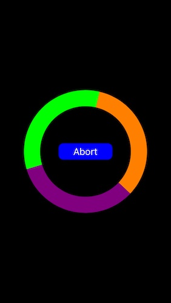
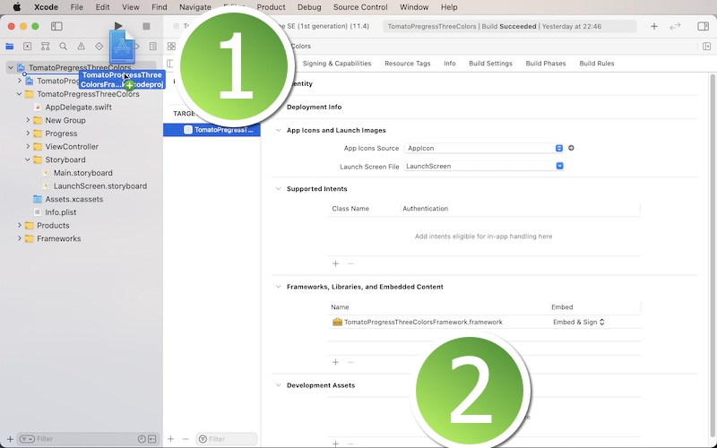

# TomatoProgressThreeColors Framework

<h2>Development and compatibility</h2>

Development platform: iOS 
Language: Swift 
Compatibility: iOS 11 or greater 

<h2>Description</h2>

TomatoProgressThreeColors lets you run a simple, circular, customizable progressive wheel with three colors of your selection.  You have options of showing or not showing a button for aborting progress on top of a number of other settings like the speed of rotation.

<h2>Using TomatoProgressThreeColors</h2>

In order to use this framework, download the sample project.  You will find the folder titled 'TomatoProgressThreeColorsFramework.'  Locate the Xcode file inside.  And put this Xcode file in your Xcode project.  Select your target and make sure you have 'TomatoProgressThreeColorsFramework.framework' under General > Framworks, Libraries, and Embeded Content as shown below.

<h2>Steps</h2>

Step 1: Import the framework to your Xcode project. 
Step 2: Import TomatoProgressThreeColorsFramework to your view controller. 
Step 3: In your view controller, create a blank UIView object whose frame is the same as that of view controller's view. 
Step 4: When you are ready to run a 3-color progressive wheel, instantiate TomatoProgressThreeColorsView to create a UIView object. 
Step 5: Add the UIView object in Step 4 to the blank UIView object in Step 3. 
Step 6: Add the blank UIView object to view controller's view. 
Step 7: If you need to take down the progress view, remove the blank UIView object from its super view. 

<h2>Initial values</h2>

strokeColor0: Stroke Color 1 
startDegree0: Starting degree (not in radians) stroke color 1 
endDegree0: Ending degree (not in radians) stroke color 1 
	
strokeColor1: Stroke Color 2 
startDegree1: Starting degree (not in radians) stroke color 2 
endDegree1: Ending degree (not in radians) stroke color 2 
	
strokeColor2: Stroke Color 3 
startDegree2: Starting degree (not in radians) stroke color 3 
endDegree2: Ending degree (not in radians) stroke color 3 
	
backColor: It's the background color of the pressive wheel UIView object. 
radius: It's the radius of the progressive wheel. 
weight: It's the stroke weight of the progressive wheel. 
slowness: It's the speed at which the progressive wheel rotates.  The smaller the number is, the faster the wheel will rotate. 
	
hasAbortButton: Set this boolean value to true if you want to show a button for aborting the progressive wheel. 
abortTitle: It's the title of the abort button. 
abortButtonHasBorder: It's the options of having or not having the border around the abort button. 
abortButtonBorderColor: It's the border color around the abort button. 
abortButtonBorderWidth: It's the border weight. 
abortButtonCornerRadius: It's the corner radius of the abort button. 
abortButtonSize: It's the abort button size. 
abortBackColor: It's the background color of the abort button. 
abortTitleNormalColor: It's the title color the abort button for the normal state. 
abortTitleHighlightedColor: It's the title color the abort button for the highlighted state. 

<h2>Notes</h2>
1. The wheel stroke values must be continuous, or the framework won't show a progessive wheel, and you will see a console message that says 'Wrong degrees!.'  That is, endDegree0 must equal startDegree1, and endDegree1 must equal startDegree2.  Additionally, the summation of the absolute values of start and end degree numbers must equal 360.
